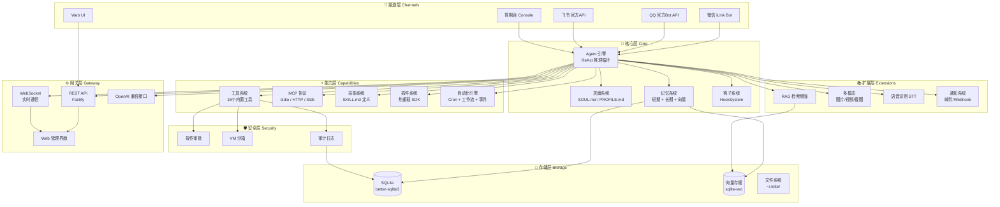
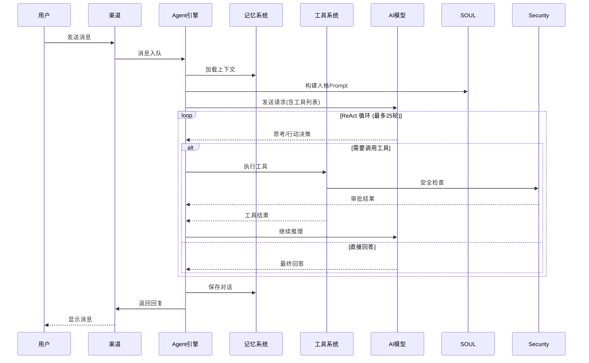
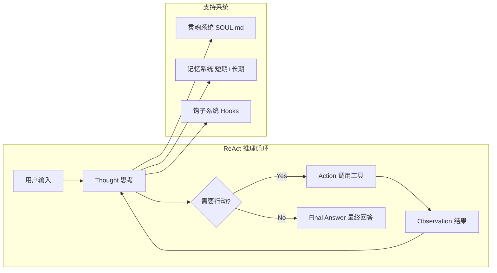
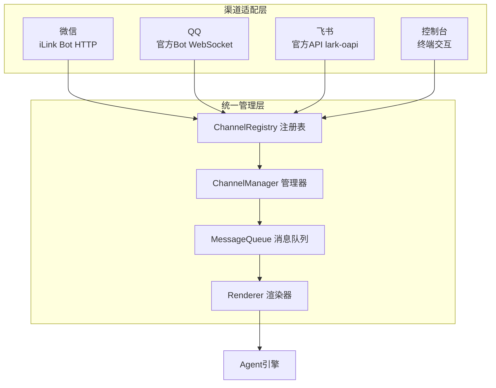
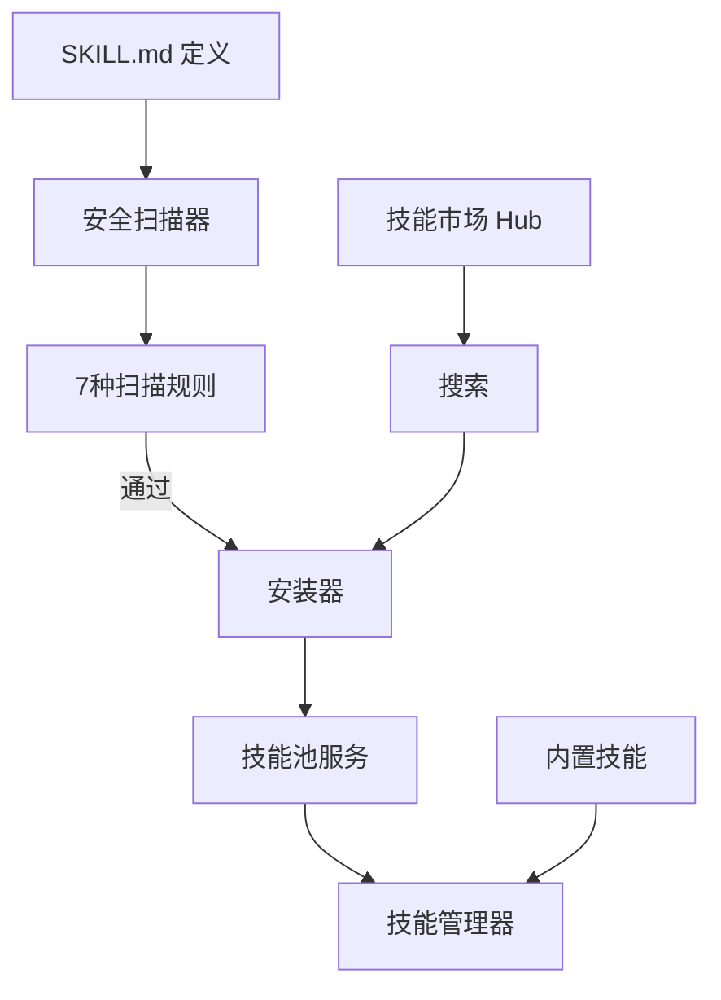
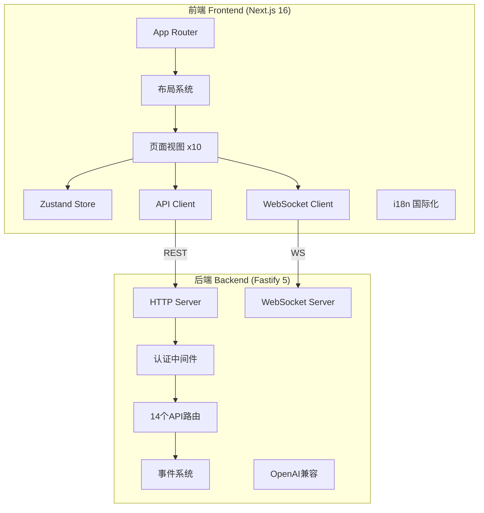
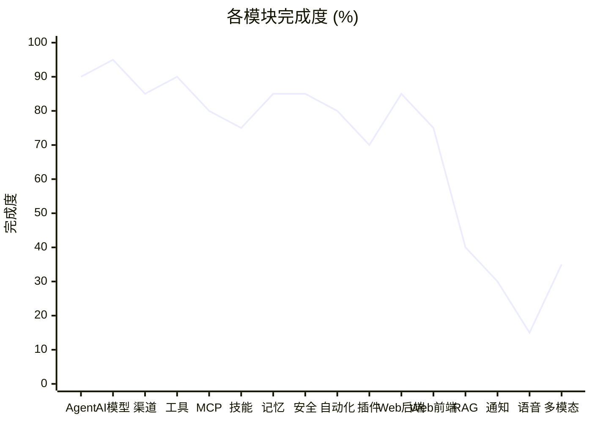
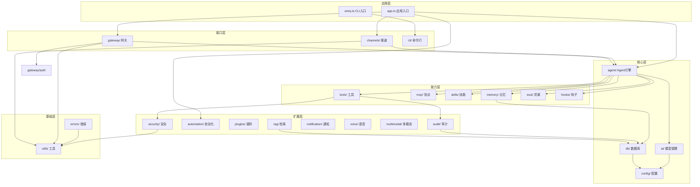

# 🌙 Lotte Agent - 项目可视化概览

> **生成日期**：2026-04-25
> **项目路径**：`D:\Trae项目\lotte-agent`
> **项目版本**：0.1.0
> **综合完成度**：约 72%

---

## 📋 目录

- [项目概述](#项目概述)
- [技术栈总览](#技术栈总览)
- [系统架构](#系统架构)
- [目录结构](#目录结构)
- [核心模块分析](#核心模块分析)
- [Web网关应用](#web网关应用)
- [开发状态统计](#开发状态统计)
- [功能特性矩阵](#功能特性矩阵)
- [依赖关系](#依赖关系)
- [参考项目对比](#参考项目对比)

---

## 🎯 项目概述

### 一句话定义

**Lotte** 是一个本地优先的**多渠道通用智能体平台**，具备自动化和编程开发能力，采用月宫守护者的人格化设计理念。

### 核心定位

| 维度 | 说明 |
|------|------|
| **项目类型** | AI Agent 智能体平台 |
| **核心语言** | TypeScript (ES2023) |
| **运行环境** | Node.js >= 22.0.0 |
| **架构模式** | 本地优先 (Local-first) |
| **设计哲学** | 月宫守护者 - 有灵魂的AI伙伴 |

### 设计理念

```
┌─────────────────────────────────────────────────────────────┐
│                    🌙 Lotte 月宫                            │
│                                                             │
│   ┌─────────┐  ┌─────────┐  ┌─────────┐  ┌─────────┐       │
│   │ 微信窗口 │  │ QQ窗口  │  │ 飞书窗口 │  │ Web窗口 │       │
│   └────┬────┘  └────┬────┘  └────┬────┘  └────┬────┘       │
│        └──────────────┼──────────────┼────────────┘         │
│                       ▼            ▼                        │
│              ┌─────────────────────────┐                    │
│              │    多渠道消息汇聚        │                    │
│              └────────────┬────────────┘                    │
│                           ▼                                 │
│              ┌─────────────────────────┐                    │
│              │   🧠 ReAct 推理引擎     │                    │
│              │   (最多25轮沉思与行动)   │                    │
│              └────────────┬────────────┘                    │
│                           ▼                                 │
│     ┌───────────┬─────────┴────────┬───────────┐           │
│     ▼           ▼                  ▼           ▼           │
│  ┌──────┐  ┌──────┐          ┌──────┐  ┌──────┐           │
│  │工具集│  │MCP协议│          │记忆系统│  │灵魂系统│         │
│  └──────┘  └──────┘          └──────┘  └──────┘           │
│                                                             │
│   💾 数据存储: ~/.lotte/  |  🔒 安全: 审批+沙箱+审计       │
└─────────────────────────────────────────────────────────────┘
```

---

## ⚙️ 技术栈总览

### 后端技术栈

| 类别 | 技术 | 版本 | 用途 |
|------|------|------|------|
| **运行时** | Node.js | >= 22.0.0 | JavaScript 运行环境 |
| **语言** | TypeScript | 5.8 | 类型安全的超集 |
| **构建工具** | tsdown | ^0.21.0 | TypeScript 打包器 |
| **包管理** | pnpm | workspace | 单仓库管理 |
| **Web框架** | Fastify | ^5.2.0 | 高性能 HTTP 服务器 |
| **数据库** | SQLite | better-sqlite3 | 嵌入式关系数据库 |
| **向量搜索** | sqlite-vec | ^0.1.0 | 向量相似度搜索 |
| **校验库** | Zod | ^3.23.0 | 运行时类型校验 |
| **测试框架** | Vitest | ^3.0.0 | 单元/集成测试 |
| **CLI框架** | Commander | ^13.0.0 | 命令行界面 |

### 前端技术栈 (Web网关)

| 类别 | 技术 | 版本 | 用途 |
|------|------|------|------|
| **框架** | Next.js | 16.2.4 | React 全栈框架 |
| **UI库** | React | 19.2.4 | 用户界面库 |
| **样式** | Tailwind CSS | ^4 | 原子化 CSS |
| **组件库** | shadcn/ui | Radix UI | 无障碍组件 |
| **状态管理** | Zustand | ^5.0.12 | 轻量状态管理 |
| **国际化** | next-intl | ^4.9.1 | i18n 支持 |
| **Markdown** | react-markdown | ^10.1.0 | Markdown 渲染 |
| **图标** | Lucide React | ^1.8.0 | 图标库 |

### AI & 协议依赖

| 类别 | 技术 | 用途 |
|------|------|------|
| **OpenAI SDK** | openai ^4.70.0 | OpenAI API 客户端 |
| **Anthropic SDK** | @anthropic-ai/sdk ^0.30.0 | Claude API 客户端 |
| **Google AI** | @google/generative-ai ^0.21.0 | Gemini API 客户端 |
| **MCP SDK** | @modelcontextprotocol/sdk ^1.0.0 | Model Context Protocol |
| **浏览器** | playwright-core ^1.50.0 | 浏览器自动化 |
| **飞书SDK** | @larksuiteoapi/node-sdk ^1.60.0 | 飞书开放平台 |

---

## 🏗️ 系统架构

### 整体架构图



### 数据流架构



---

## 📁 目录结构

### 项目根目录结构

```
lotte-agent/
├── 📄 package.json                 # 主项目配置 (lotte-agent)
├── 📄 tsconfig.json                # TypeScript 配置
├── 📄 tsdown.config.ts             # tsdown 构建配置
├── 📄 vitest.config.ts             # 测试配置
├── 📄 eslint.config.js             # ESLint 规则
├── 📄 .prettierrc.json             # Prettier 格式化
├── 📄 pnpm-workspace.yaml          # pnpm workspace 配置
│
├── 📁 src/                         # 🔧 后端源代码 (~140个文件)
│   ├── 📁 agent/                   # Agent 核心 (5文件, ~800行)
│   ├── 📁 ai/                      # AI 模型管理 (12文件, ~1200行)
│   ├── 📁 channels/                # 多渠道接入 (10文件, ~2000行)
│   ├── 📁 config/                  # 配置管理 (9文件, ~1000行)
│   ├── 📁 db/                      # 数据库层 (2文件, ~600行)
│   ├── 📁 gateway/                 # Web网关后端 (20文件, ~2500行)
│   ├── 📁 mcp/                     # MCP协议 (11文件, ~800行)
│   ├── 📁 skills/                  # 技能系统 (11文件, ~1000行)
│   ├── 📁 memory/                  # 记忆系统 (5文件, ~600行)
│   ├── 📁 tools/                   # 工具系统 (10文件, ~1500行)
│   ├── 📁 security/                # 安全机制 (3文件, ~500行)
│   ├── 📁 automation/              # 自动化引擎 (7文件, ~800行)
│   ├── 📁 plugins/                 # 插件系统 (5文件, ~600行)
│   ├── 📁 rag/                     # RAG检索 (6文件, ~700行)
│   ├── 📁 notification/            # 通知系统 (6文件, ~600行)
│   ├── 📁 voice/                   # 语音识别 (2文件, ~200行)
│   ├── 📁 multimodal/              # 多模态 (8文件, ~800行)
│   ├── 📁 utils/                   # 工具函数 (6文件, ~400行)
│   ├── 📁 hooks/                   # 钩子系统 (2文件, ~300行)
│   ├── 📁 audit/                   # 审计日志 (3文件, ~200行)
│   ├── 📁 errors/                  # 错误处理 (3文件)
│   ├── 📁 soul/                    # 灵魂系统 (3文件)
│   ├── 📁 cli/                     # 命令行 (2文件)
│   ├── 📄 app.ts                   # 应用入口
│   ├── 📄 entry.ts                 # CLI 入口
│   └── 📄 index.ts                 # 库导出
│
├── 📁 web/                         # 🌐 Web网关前端 (Next.js 16)
│   ├── 📄 package.json             # 前端依赖配置
│   ├── 📄 next.config.ts           # Next.js 配置
│   ├── 📁 public/                  # 静态资源
│   ├── 📁 scripts/                 # 构建脚本
│   └── 📁 src/                     # React 源码
│       ├── 📁 app/                 # App Router 页面
│       ├── 📁 components/          # 组件库
│       │   ├── 📁 layout/          # 布局组件 (侧边栏/顶栏/内容区)
│       │   ├── 📁 ui/              # 基础UI组件 (20+ shadcn组件)
│       │   └── 📁 views/           # 页面视图 (10个功能视图)
│       └── 📁 lib/                 # 工具库
│           ├── 📁 api-client/      # API客户端
│           ├── 📁 config/          # 前端配置
│           ├── 📁 store/           # Zustand 状态管理
│           ├── 📁 ws-client/       # WebSocket 客户端
│           └── 📁 i18n/            # 国际化 (中/英)
│
└── 📁 project-overview/            # 📚 项目文档
    └── 📁 Web/                     # Web相关文档 (9个MD文件)
```

### 后端核心模块详情

```
src/
├── agent/                          # 🧠 Agent 核心
│   ├── react-engine.ts             # ReAct 推理循环引擎
│   ├── session.ts                  # 会话管理器
│   ├── tool-invoker.ts             # 工具调用器
│   ├── task-queue.ts               # 任务队列
│   └── concurrency.ts              # 并发控制
│
├── ai/                             # 🤖 AI 模型管理
│   ├── model-manager.ts            # 多Provider管理器
│   ├── openai-provider.ts          # OpenAI 适配器
│   ├── anthropic-provider.ts       # Anthropic Claude 适配器
│   ├── gemini-provider.ts          # Google Gemini 适配器
│   ├── custom-provider.ts          # 自定义API适配器
│   ├── provider.ts                 # Provider 抽象基类
│   ├── rate-limiter.ts             # 速率限制器
│   ├── multimodal-prober.ts        # 多模态探测
│   └── types.ts                    # 类型定义
│
├── channels/                       # 📡 多渠道接入
│   ├── base.ts                     # 通道抽象基类
│   ├── manager.ts                  # 通道统一管理器
│   ├── registry.ts                 # 通道注册表
│   ├── queue.ts                    # 消息队列
│   ├── renderer.ts                 # 消息渲染器
│   ├── weixin/                     # 微信通道
│   │   ├── channel.ts              # 微信通道实现
│   │   ├── client.ts               # iLink HTTP客户端
│   │   ├── constants.ts            # 常量定义
│   │   └── utils.ts                # 工具函数
│   ├── qq/                         # QQ通道
│   │   ├── channel.ts              # QQ通道实现 (WebSocket)
│   │   ├── constants.ts            # 常量定义
│   │   └── utils.ts                # 工具函数
│   ├── feishu/                     # 飞书通道
│   │   ├── channel.ts              # 飞书通道实现
│   │   ├── constants.ts            # 常量定义
│   │   └── utils.ts                # 工具函数
│   └── console/                    # 控制台通道
│       └── channel.ts              # 终端交互实现
│
├── gateway/                        # 🌐 Web网关后端
│   ├── server.ts                   # Fastify HTTP服务器
│   ├── auth.ts                     # 认证中间件
│   ├── websocket.ts                # WebSocket管理器
│   ├── events.ts                   # 事件发射器
│   ├── openai-compat.ts            # OpenAI兼容接口
│   ├── web-ui.ts                   # Web UI服务
│   └── routes/                     # API路由 (14个模块)
│       ├── chat.ts                 # 聊天接口
│       ├── session.ts              # 会话管理
│       ├── config.ts               # 配置管理
│       ├── tools.ts                # 工具接口
│       ├── approval.ts             # 审批接口
│       ├── logs.ts                 # 日志查询
│       ├── health.ts               # 健康检查
│       ├── mcp.ts                  # MCP管理
│       ├── skills.ts               # 技能管理
│       ├── plugins.ts              # 插件管理
│       ├── channels.ts             # 渠道管理
│       ├── automation.ts           # 自动化管理
│       ├── rag.ts                  # RAG管理
│       └── notification.ts         # 通知管理
│
├── tools/                          # 🔧 工具系统
│   ├── tool-registry.ts            # 工具注册表
│   ├── base.ts                     # 工具基类定义
│   └── impl/                       # 工具实现 (8个核心工具)
│       ├── bash-tool.ts            # Shell命令执行
│       ├── file-tools.ts           # 文件操作 (读/写/编辑/列)
│       ├── browser-tools.ts        # 浏览器自动化
│       ├── network-tools.ts        # 网络请求 (HTTP/搜索)
│       ├── git-tool.ts             # Git操作
│       ├── code-tools.ts           # 代码分析
│       ├── memory-tools.ts         # 记忆管理
│       └── audit-tool.ts           # 审计查询
│
├── mcp/                            # 🔗 MCP协议
│   ├── manager.ts                  # MCP客户端管理器
│   ├── client.ts                   # MCP客户端基类
│   ├── stateful-client.ts          # 有状态客户端
│   ├── stdio-transport.ts          # StdIO传输
│   ├── http-transport.ts           # HTTP传输
│   ├── sse-transport.ts            # SSE传输
│   ├── recovery.ts                 # 故障恢复
│   ├── watcher.ts                  # 配置监控
│   └── types.ts                    # 类型定义
│
├── skills/                         # ✨ 技能系统
│   ├── manager.ts                  # 技能管理器
│   ├── hub.ts                      # 技能市场
│   ├── installer.ts                # 安装器
│   ├── scanner.ts                  # 安全扫描器
│   ├── pool-service.ts             # 技能池服务
│   ├── builtins.ts                 # 内置技能
│   ├── scanner-rules/              # 扫描规则 (7种)
│   │   ├── prompt-injection.ts     # 提示注入检测
│   │   ├── command-injection.ts    # 命令注入检测
│   │   ├── data-leakage.ts         # 数据泄露检测
│   │   ├── privilege-escalation.ts  # 权限提升检测
│   │   ├── resource-abuse.ts       # 资源滥用检测
│   │   └── obfuscation.ts         # 混淆检测
│   └── types.ts                    # 类型定义
│
├── memory/                         # 💾 记忆系统
│   ├── memory-manager.ts           # 记忆管理器
│   ├── short-term.ts               # 短期记忆 (InMemory)
│   ├── long-term.ts                # 长期记忆 (向量存储)
│   └── compactor.ts               # 上下文压缩器
│
├── security/                       # 🛡️ 安全机制
│   ├── approval.ts                 # 操作审批系统
│   ├── sandbox.ts                  # VM沙箱隔离
│   └── index.ts                    # 安全导出
│
├── automation/                     # ⚡ 自动化引擎
│   ├── manager.ts                  # 自动化管理器
│   ├── cron-scheduler.ts           # Cron定时调度
│   ├── workflow-engine.ts          # 工作流编排引擎
│   ├── trigger-manager.ts          # 触发器管理
│   ├── event-bus.ts               # 事件总线
│   └── types.ts                    # 类型定义
│
├── multimodal/                     # 👁️ 多模态系统
│   ├── media/                      # 媒体处理
│   │   ├── image-ops.ts           # 图片操作
│   │   ├── parse.ts               # 媒体解析
│   │   ├── server.ts              # 媒体服务器
│   │   └── store.ts               # 媒体存储
│   ├── vision/                     # 视觉理解
│   │   ├── vision-runner.ts       # Vision运行器
│   │   └── image-loader.ts        # 图片加载器
│   ├── video/                      # 视频理解
│   │   └── video-runner.ts        # 视频运行器
│   └── screenshot/                 # 截图功能
│       └── screenshot.ts          # 截图工具
│
└── ...                             # 其他模块 (config/db/utils等)
```

---

## 🔍 核心模块分析

### 1. Agent 引擎 (完成度 90%)



**关键文件**：
- [react-engine.ts](file:///d:/Trae项目/lotte-agent/src/agent/react-engine.ts) - ReAct推理循环，支持最多25轮迭代
- [session.ts](file:///d:/Trae项目/lotte-agent/src/agent/session.ts) - 会话生命周期管理
- [tool-invoker.ts](file:///d:/Trae项目/lotte-agent/src/agent/tool-invoker.ts) - 动态工具调用

### 2. AI 模型管理 (完成度 95%)

| Provider | 支持状态 | 特性 |
|----------|---------|------|
| **OpenAI** | ✅ 完成 | GPT-4o/GPT-4o-mini, 流式输出 |
| **Anthropic Claude** | ✅ 完成 | Claude Sonnet 4, 长上下文200K |
| **Google Gemini** | ✅ 完成 | Gemini Pro, 多模态支持 |
| **自定义API** | ✅ 完成 | 兼容OpenAI格式, 本地模型 |

**关键能力**：
- 多Provider动态切换
- 模型别名系统
- 上下文窗口自动管理
- 速率限制保护
- 多模态探测 (文本/图片/视频)

### 3. 多渠道接入 (完成度 85%)



**支持的渠道**：
- **微信**: 个人微信 iLink Bot HTTP API
- **QQ**: 官方 Bot API (WebSocket 协议)
- **飞书**: 官方开放平台 API (@larksuiteoapi/node-sdk)
- **控制台**: 内置终端交互通道

### 4. 工具系统 (完成度 90%)

| 工具名称 | 功能 | 文件 | 状态 |
|---------|------|------|------|
| **Bash Tool** | Shell命令执行 | `bash-tool.ts` | ✅ |
| **File Tools** | 文件读写编辑 | `file-tools.ts` | ✅ |
| **Browser Tools** | 浏览器自动化 | `browser-tools.ts` | ✅ |
| **Network Tools** | HTTP请求/搜索 | `network-tools.ts` | ✅ |
| **Git Tool** | Git版本控制 | `git-tool.ts` | ✅ |
| **Code Tools** | 代码分析 | `code-tools.ts` | ✅ |
| **Memory Tools** | 记忆管理 | `memory-tools.ts` | ✅ |
| **Audit Tool** | 审计查询 | `audit-tool.ts` | ✅ |

**安全管道**：
```
用户请求 → 权限检查 → 操作审批 → VM沙箱 → 工具执行 → 结果返回
```

### 5. MCP 协议 (完成度 80%)

**支持的传输协议**：
- ✅ StdIO (标准输入输出)
- ✅ HTTP (streamable-http)
- ✅ SSE (Server-Sent Events)

**核心能力**：
- MCP客户端连接管理
- 有状态会话保持
- 故障自动恢复
- 配置热重载监控
- 工具发现与调用代理

### 6. 技能系统 (完成度 75%)



**安全扫描规则**：
1. Prompt Injection (提示注入)
2. Command Injection (命令注入)
3. Data Leakage (数据泄露)
4. Privilege Escalation (权限提升)
5. Resource Abuse (资源滥用)
6. Obfuscation (代码混淆)

### 7. 记忆系统 (完成度 85%)

| 类型 | 实现 | 特性 |
|------|------|------|
| **短期记忆** | InMemory | 当前会话消息列表 |
| **长期记忆** | 向量存储 | MEMORY.md + sqlite-vec |
| **压缩器** | ContextCompactor | 自动上下文压缩 |

**工作流程**：
```
新消息 → 短期记忆缓冲 → 达到阈值 → 压缩器处理 → 长期记忆存储 → 向量化索引
```

### 8. 安全机制 (完成度 85%)

| 机制 | 实现 | 说明 |
|------|------|------|
| **操作审批** | ApprovalSystem | 敏感操作需确认, WebSocket实时推送 |
| **VM沙箱** | VMSandbox | 文件系统/网络限制, 超时/内存限制 |
| **审计日志** | AuditLogger | 全链路记录, 支持查询过滤分页 |

---

## 🖥️ Web网关应用

### 技术架构



### 前端组件结构

```
web/src/
├── app/                           # Next.js App Router
│   ├── layout.tsx                 # 根布局
│   ├── page.tsx                   # 首页
│   ├── globals.css                # 全局样式
│   └── not-found.tsx             # 404页面
│
├── components/
│   ├── layout/                    # 布局组件
│   │   ├── sidebar.tsx           # 侧边导航栏
│   │   ├── topbar.tsx            # 顶部工具栏
│   │   └── main-content.tsx      # 主内容区
│   │
│   ├── ui/                        # 基础UI组件 (shadcn/ui)
│   │   ├── button.tsx            # 按钮
│   │   ├── card.tsx              # 卡片
│   │   ├── dialog.tsx            # 对话框
│   │   ├── input.tsx             # 输入框
│   │   ├── table.tsx             # 表格
│   │   ├── tabs.tsx              # 标签页
│   │   ├── select.tsx            # 选择器
│   │   ├── switch.tsx            # 开关
│   │   ├── avatar.tsx            # 头像
│   │   ├── badge.tsx             # 徽章
│   │   ├── dropdown-menu.tsx     # 下拉菜单
│   │   ├── popover.tsx           # 弹出框
│   │   ├── scroll-area.tsx       # 滚动区域
│   │   ├── separator.tsx         # 分隔线
│   │   ├── sheet.tsx             # 侧边抽屉
│   │   ├── skeleton.tsx          # 骨架屏
│   │   ├── slider.tsx            # 滑块
│   │   ├── progress.tsx          # 进度条
│   │   ├── textarea.tsx          # 文本域
│   │   ├── tooltip.tsx           # 工具提示
│   │   └── label.tsx             # 标签
│   │
│   └── views/                     # 功能页面视图 (10个)
│       ├── chat-view.tsx         # 💬 聊天界面
│       ├── sessions-view.tsx     # 📋 会话管理
│       ├── config-view.tsx       # ⚙️ 配置管理
│       ├── tools-view.tsx        # 🔧 工具面板
│       ├── skills-view.tsx       # ✨ 技能市场
│       ├── mcp-view.tsx          # 🔗 MCP管理
│       ├── channels-view.tsx     # 📡 渠道配置
│       ├── automation-view.tsx   # ⚡ 自动化任务
│       ├── logs-view.tsx         # 📝 日志查看
│       ├── notification-view.tsx # 🔔 通知中心
│       └── rag-view.tsx          # 📚 RAG知识库
│
└── lib/                           # 工具库
    ├── api-client.ts             # REST API客户端
    ├── config.ts                 # 前端配置
    ├── store.ts                  # Zustand全局状态
    ├── ws-client.ts              # WebSocket客户端
    ├── utils.ts                  # 通用工具函数
    └── i18n/                     # 国际化配置
        ├── index.ts              # i18n初始化
        ├── zh.json               # 中文翻译
        └── en.json               # 英文翻译
```

### 页面视图功能说明

| 视图 | 路由 | 功能描述 | 状态 |
|------|------|---------|------|
| **chat-view** | `/chat` | 实时聊天界面, 支持Markdown渲染 | ✅ |
| **sessions-view** | `/sessions` | 会话列表, 创建/删除/切换会话 | ✅ |
| **config-view** | `/config` | 系统配置编辑 (JSON Schema表单) | ✅ |
| **tools-view** | `/tools` | 内置工具展示与管理 | ✅ |
| **skills-view** | `/skills` | 技能市场浏览, 安装/卸载技能 | ✅ |
| **mcp-view** | `/mcp` | MCP服务连接管理与测试 | ✅ |
| **channels-view** | `/channels` | 多渠道配置与状态监控 | ✅ |
| **automation-view** | `/automation` | 定时任务/工作流/触发器管理 | ✅ |
| **logs-view** | `/logs` | 审计日志查询与过滤 | ✅ |
| **notification-view** | `/notifications` | 通知历史与配置 | ✅ |
| **rag-view** | `/rag` | 文档上传, 向量化, 检索测试 | ✅ |

---

## 📊 开发状态统计

### 模块完成度一览



### 详细统计数据

| 模块 | 文件数 | 代码行数(估) | 完成度 | 状态 |
|------|--------|-------------|--------|------|
| `src/agent/` | 5 | ~800 | 90% | ✅ 基本完成 |
| `src/ai/` | 12 | ~1,200 | 95% | ✅ 完成 |
| `src/channels/` | 10 | ~2,000 | 85% | ✅ 基本完成 |
| `src/config/` | 9 | ~1,000 | 95% | ✅ 完成 |
| `src/db/` | 2 | ~600 | 90% | ✅ 基本完成 |
| `src/gateway/` | 20 | ~2,500 | 85% | ✅ 基本完成 |
| `src/mcp/` | 11 | ~800 | 80% | ⚠️ 部分完成 |
| `src/skills/` | 11 | ~1,000 | 75% | ⚠️ 部分完成 |
| `src/memory/` | 5 | ~600 | 85% | ✅ 基本完成 |
| `src/tools/` | 10 | ~1,500 | 90% | ✅ 基本完成 |
| `src/security/` | 3 | ~500 | 85% | ✅ 基本完成 |
| `src/automation/` | 7 | ~800 | 80% | ⚠️ 部分完成 |
| `src/plugins/` | 5 | ~600 | 70% | ⚠️ 部分完成 |
| `src/rag/` | 6 | ~700 | 40% | ❌ 未完成 |
| `src/notification/` | 6 | ~600 | 30% | ❌ 未完成 |
| `src/voice/` | 2 | ~200 | 15% | ❌ 未完成 |
| `src/multimodal/` | 8 | ~800 | 35% | ❌ 未完成 |
| `web/` (前端) | 30+ | ~3,000 | 75% | ⚠️ 部分完成 |
| **总计** | **~162** | **~20,300** | **72%** | **进行中** |

### 开发阶段进度

| 阶段 | 名称 | 进度 | 关键里程碑 |
|------|------|------|-----------|
| **阶段1** | 项目基础设施搭建 | ✅ 100% | 构建/配置/数据库/错误处理 |
| **阶段2** | 核心引擎开发 | ✅ 100% | AI模型/Agent/记忆/灵魂/钩子/工具框架/安全 |
| **阶段3** | 工具实现 | ✅ 100% | 7个核心工具全部完成 |
| **阶段4** | Web网关基础 | ✅ 100% | Fastify/认证/WS/API路由/OpenAI兼容 |
| **阶段5** | 高级功能 | 🔄 60% | 多渠道/MCP/技能/自动化/插件部分完成 |
| **阶段6** | 扩展功能 | ⏳ 20% | RAG/通知/语音/多模态待完善 |

### 测试覆盖情况

| 模块 | 测试文件 | 状态 |
|------|---------|------|
| Agent Session | `agent/session.test.ts` | ✅ 已有 |
| Channel 消息 | `channels/channels.test.ts` | ✅ 已有 |
| Config Schema | `config/schema.test.ts` | ✅ 已有 |
| MCP 连接 | `mcp/mcp.test.ts` | ✅ 已有 |
| Memory 短期 | `memory/short-term.test.ts` | ✅ 已有 |
| Security 沙箱 | `security/sandbox.test.ts` | ✅ 已有 |
| Audit 日志 | `audit/logger.test.ts` | ✅ 已有 |
| Tools 注册 | `tools/tool-registry.test.ts` | ✅ 已有 |
| API集成 | `gateway/routes/api-integration.test.ts` | ✅ 已有 |
| Multimodal 视频 | `multimodal/video/video-runner.test.ts` | ✅ 已有 |
| AI 多模态探测 | `ai/multimodal-prober.test.ts` | ✅ 已有 |
| Gateway WebSocket | `gateway/websocket.test.ts` | ✅ 已有 |

**测试覆盖率**: 核心模块已覆盖，共12个测试文件

---

## ✨ 功能特性矩阵

### 核心功能清单

| 功能类别 | 功能项 | 实现状态 | 说明 |
|---------|--------|---------|------|
| **🧠 智能体核心** | | | |
| | ReAct 推理循环 | ✅ | 最多25轮思考-行动循环 |
| | 多模型支持 | ✅ | OpenAI/Claude/Gemini/自定义 |
| | 流式输出 | ✅ | SSE实时返回 |
| | 并发控制 | ✅ | 任务队列+并发限制 |
| | 会话管理 | ✅ | 创建/中止/状态追踪 |
| **🔧 工具系统** | | | |
| | Bash 执行 | ✅ | Shell命令, PTY支持 |
| | 文件操作 | ✅ | 读/写/编辑/列表 |
| | 浏览器自动化 | ✅ | Playwright导航/点击/截图 |
| | 网络请求 | ✅ | HTTP/HTTPS/WebSearch |
| | Git 操作 | ✅ | commit/push/pull/log |
| | 代码分析 | ✅ | 搜索/分析/理解 |
| **📡 多渠道** | | | |
| | 微信接入 | ✅ | iLink Bot HTTP API |
| | QQ 接入 | ✅ | 官方Bot WebSocket |
| | 飞书接入 | ✅ | lark-oapi SDK |
| | 控制台 | ✅ | 终端交互 |
| | 消息队列 | ✅ | 异步处理+防抖 |
| **🔗 MCP协议** | | | |
| | StdIO 传输 | ✅ | 子进程通信 |
| | HTTP 传输 | ✅ | streamable-http |
| | SSE 传输 | ✅ | Server-Sent Events |
| | 服务发现 | ✅ | 配置驱动加载 |
| | 故障恢复 | ✅ | 自动重连 |
| **✨ 技能系统** | | | |
| | SKILL.md 定义 | ✅ | Markdown格式技能定义 |
| | 安全扫描 | ✅ | 7种攻击模式检测 |
| | 技能池 | ✅ | 动态加载/卸载 |
| | 内置技能 | ✅ | 基础技能集 |
| | 技能市场 | ⚠️ | Hub框架已有, 搜索待完善 |
| **💾 记忆系统** | | | |
| | 短期记忆 | ✅ | InMemory消息列表 |
| | 长期记忆 | ✅ | 向量存储+MEMORY.md |
| | 向量搜索 | ✅ | sqlite-vec相似度检索 |
| | 上下文压缩 | ✅ | 自动压缩长对话 |
| **🛡️ 安全机制** | | | |
| | 操作审批 | ✅ | 敏感操作确认+WS推送 |
| | VM沙箱 | ✅ | 文件/网络/内存限制 |
| | 审计日志 | ✅ | 全链路记录+查询 |
| | 速率限制 | ✅ | API调用频率控制 |
| **⚡ 自动化** | | | |
| | Cron 定时 | ✅ | Crontab表达式调度 |
| | 工作流编排 | ✅ | 多步骤任务引擎 |
| | 事件触发 | ✅ | 事件总线+规则引擎 |
| | 任务管理 | ✅ | 创建/启停/监控 |
| **🌐 Web网关** | | | |
| | REST API | ✅ | 14个路由模块 |
| | WebSocket | ✅ | 实时双向通信 |
| | OpenAI兼容 | ✅ | /v1/chat/completions |
| | Web管理界面 | ✅ | 10个功能页面 |
| | 认证鉴权 | ✅ | Token/Password/None |
| **📚 扩展功能** | | | |
| | RAG 检索 | ⚠️ | Schema已有, 实现待完善 |
| | 多模态视觉 | ⚠️ | 图片理解框架已有 |
| | 视频理解 | ⚠️ | 视频Runner已有 |
| | 截图功能 | ⚠️ | screenshot-desktop集成 |
| | 语音识别 | ⚠️ | Whisper配置Schema |
| | 通知系统 | ⚠️ | 邮件/Webhook框架 |
| | 插件系统 | ⚠️ | SDK+jiti热重载 |
| | 国际化 | ✅ | 中/英双语 |

---

## 🔗 依赖关系

### 核心依赖图谱



### 外部依赖关系

```mermaid
graph LR
    subgraph "运行时"
        NODE[Node.js >=22]
    end

    subgraph "核心依赖"
        FASTIFY[Fastify 5]
        OPENAI[openai SDK]
        ANTHROPIC[@anthropic-ai/sdk]
        GEMINI[@google/generative-ai]
        ZOD[Zod 校验]
        SQLITE[better-sqlite3]
    end

    subgraph "通信"
        WS[ws WebSocket]
        UNDICI[undici HTTP]
    end

    subgraph "工具链"
        PLAYWRIGHT[playwright-core]
        SHARP[sharp 图片处理]
        FFMPEG[fluent-ffmpeg 视频]
        PDFJS[pdfjs-dist PDF]
    end

    subgraph "渠道SDK"
        LARK[@larksuiteoapi/node-sdk]
        QRCODE[qrcode-terminal]
    end

    subgraph "其他"
        CHOKIDAR[chokidar 监控]
        CRONER[croner 定时]
        JITI[jiti 动态导入]
        COMMANDER[commander CLI]
        MARKDOWN[markdown-it MD解析]
    end

    NODE --> FASTIFY
    NODE --> OPENAI
    NODE --> ANTHROPIC
    NODE --> GEMINI
    FASTIFY --> WS
    FASTIFY --> UNDICI
    TOOLS --> PLAYWRIGHT
    TOOLS --> SHARP
    MULTIMODAL --> FFMPEG
    MULTIMODAL --> PDFJS
    CHANNELS --> LARK
    CHANNELS --> QRCODE
    CONFIG --> CHOKIDAR
    AUTOMATION --> CRONER
    PLUGINS --> JITI
    CLI --> COMMANDER
    SKILLS --> MARKDOWN
```

---

## 🔄 参考项目对比

### vs OpenClaw (主要参考)

| 维度 | Lotte | OpenClaw | 差异说明 |
|------|-------|----------|---------|
| **语言** | TypeScript | TypeScript | 一致 |
| **定位** | 多渠道智能体 | AI Agent平台 | Lotte强调多渠道 |
| **Agent引擎** | ReAct (25轮) | ReAct | 相似, Lotte增加并发控制 |
| **工具系统** | 8个内置+MCP扩展 | 工具策略管道 | Lotte参考其策略管道设计 |
| **Web网关** | Fastify + Next.js | Fastify | Lotte增加React管理界面 |
| **多模态** | 图片/视频/截图 | Vision/Video/Screenshot | 架构一致 |
| **媒体管理** | MEDIA Token | Media Server | 参考 OpenClaw 的媒体处理 |
| **渠道接入** | 微信/QQ/飞书/Console | 无 | Lotte独有, 参考CoPaw |
| **灵魂系统** | SOUL.md/PROFILE.md | 无 | Lotte独有, 参考CoPaw |
| **技能系统** | SKILL.md + 扫描 | 无 | Lotte独有, 参考CoPaw |

### vs CoPaw (次要参考)

| 维度 | Lotte | CoPaw | 差异说明 |
|------|-------|-------|---------|
| **语言** | TypeScript | Python | 不同, Lotte选择TS生态 |
| **渠道** | 微信/QQ/飞书 | 微信/QQ/飞书 | 一致, Lotte完全复用架构 |
| **MCP协议** | stdio/HTTP/SSE | stdio/HTTP | Lotte增加SSE传输 |
| **技能系统** | SKILL.md + 7种扫描 | SKILL.md | Lotte增加安全扫描 |
| **记忆系统** | 短期+长期+向量 | 短期+长期+压缩 | Lotte增加向量搜索 |
| **灵魂系统** | SOUL.md/PROFILE.md/AGENTS.md | SOUL.md/PROFILE.md | Lotte增加AGENTS.md |
| **Web网关** | Next.js + shadcn/ui | 无 | CoPaw无独立Web UI |
| **自动化** | Cron/工作流/事件 | 无 | Lotte独有功能 |
| **插件系统** | SDK + jiti热重载 | 无 | Lotte独有功能 |

### 技术选型优势

| 选型 | 选择理由 | 来源参考 |
|------|---------|---------|
| **TypeScript** | 类型安全, 生态丰富, IDE支持好 | OpenClaw一致 |
| **Fastify 5** | 高性能, 低开销, 插件生态 | OpenClaw一致 |
| **Next.js 16** | React全栈, SSR/SSG, App Router | 现代前端最佳实践 |
| **Tailwind CSS 4** | 原子化CSS, 开发效率高 | 现代CSS方案 |
| **shadcn/ui** | 可定制, 无障碍, Radix基础 | 现代UI方案 |
| **Zustand** | 轻量, 简单, TypeScript友好 | 状态管理首选 |
| **SQLite** | 嵌入式, 零配置, 够用即可 | 本地优先架构 |
| **pnpm workspace** | 单仓库, 高效磁盘利用 | monorepo最佳实践 |

---

## 📈 项目亮点

### ✅ 已完成的优秀设计

1. **完整的配置管理体系**
   - JSON Schema 定义 + Zod 运行时校验
   - 配置模板自动生成
   - 热更新监控 (chokidar)
   - 路径统一管理 (`~/.lotte/`)

2. **强大的 Agent 引擎**
   - ReAct 推理循环, 最多25轮深度思考
   - 流式输出支持 (SSE)
   - 并发控制和任务队列
   - 钩子系统 (压缩/引导/记忆)

3. **灵活的多模型支持**
   - 4种 Provider (OpenAI/Claude/Gemini/自定义)
   - 模型别名系统
   - 上下文窗口自动管理
   - 速率限制保护

4. **丰富的内置工具**
   - 8个核心工具覆盖开发全流程
   - 安全策略管道 (审批→沙箱→执行)
   - 浏览器自动化 (Playwright)
   - 代码分析和Git操作

5. **完善的 Web 网关**
   - 14个 RESTful API 路由
   - WebSocket 实时通信
   - OpenAI 兼容接口
   - 10个功能页面的管理界面
   - 中英双语国际化

6. **多层次安全防护**
   - 操作审批系统 (WebSocket实时推送)
   - VM 沙箱隔离 (文件/网络/内存限制)
   - 全链路审计日志
   - 技能安全扫描 (7种攻击检测)

### 🚀 架构优势

- **本地优先**: 所有数据存储在本地, 隐私安全
- **模块化设计**: 19个独立模块, 松耦合高内聚
- **可扩展性**: MCP协议 + 插件系统 + 技能市场
- **多渠道统一**: 抽象通道层, 统一消息处理
- **开发者友好**: TypeScript全栈, 完整类型定义

---

## 📌 总结

Lotte Agent 是一个**架构完整、设计精良**的多渠道通用智能体平台。项目已完成**核心框架搭建** (72%综合完成度), Agent引擎、AI模型管理、工具系统、Web网关等关键模块均已实现并可运行。

### 当前优势
✅ 技术栈现代且一致 (TypeScript + Fastify + Next.js)
✅ 核心功能完备 (ReAct引擎、多模型、多渠道、18个工具)
✅ 架构设计优秀 (模块化、可扩展、安全优先)
✅ 文档体系完善 (9份专业文档)
✅ 参考项目明确 (OpenClaw架构 + CoPaw功能)

### 待完善方向
⚠️ RAG检索增强实现 (40%)
⚠️ 通知系统完善 (30%)
⚠️ 语音识别集成 (15%)
⚠️ 多模态系统深化 (35%)
⚠️ 插件系统生态 (70%)
⚠️ 测试覆盖提升 (核心模块已有, 待扩展)

### 发展潜力
Lotte 具备成为**开源领域领先的本地优先智能体平台**的潜力, 其完整的架构设计和丰富的功能规划为后续发展奠定了坚实基础。

---

> 📖 **相关文档**
> - [Lotte功能与配置使用指南](./Lotte功能与配置使用指南.md)
> - [Lotte开发进度分析报告](./Lotte开发进度分析报告.md)
> - [项目开发状态分析报告](./项目开发状态分析报告.md)
> - [Web网关应用文档](./Web网关应用文档.md)
> - [Lotte-API接口文档](./Lotte-API接口文档.md)
> - [Lotte-开发者指南](./Lotte-开发者指南.md)
> - [Lotte-技能开发文档](./Lotte-技能开发文档.md)
> - [Lotte-插件开发文档](./Lotte-插件开发文档.md)
> - [Lotte-部署运维文档](./Lotte-部署运维文档.md)

---

*🌙 穹宇之上，宫阙泛起冰冷光泽。柔软的羽翼经受着月色洗礼，在皎洁的柔晖中舒展、飘飞。少女轻阖双眸，守护着最珍贵的愿望。*
